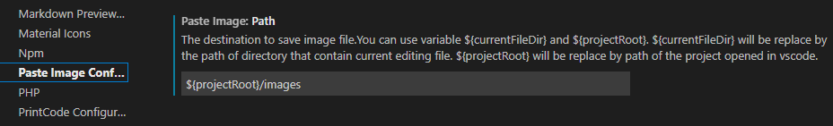

# Welcome 

안녕하세요 Gon 입니다.

## Github 블로그 만들기 동영상

- [깃헙(Github) 블로그 만들기 - 시즌1](https://www.youtube.com/watch?v=--MMmHbSH9k&list=PLIMb_GuNnFwfQBZQwD-vCZENL5YLDZekr)

[깃헙(GitHub) 블로그 10분안에 완성하기](https://www.youtube.com/watch?v=ACzFIAOsfpM)

[새로 포스트 작성하는법](https://jekyllrb.com/docs/posts/)

[Minimal Mistakes](https://mmistakes.github.io/minimal-mistakes/docs/quick-start-guide/)

#### 이미지 저장 폴더 설정  

[VScode에서 이미지 캡쳐를 확장 프로그램 사용하기](https://uxgjs.tistory.com/187)

##### root/images 폴더 생성 한다.

##### 저장할 폴더 설졍 변경

#### 댓글 기능 
https://krdn.disqus.com/admin/

#### 구글 애널리틱스
https://analytics.google.com/
https://analytics.google.com/analytics/web/provision/#/analysis/p298509910