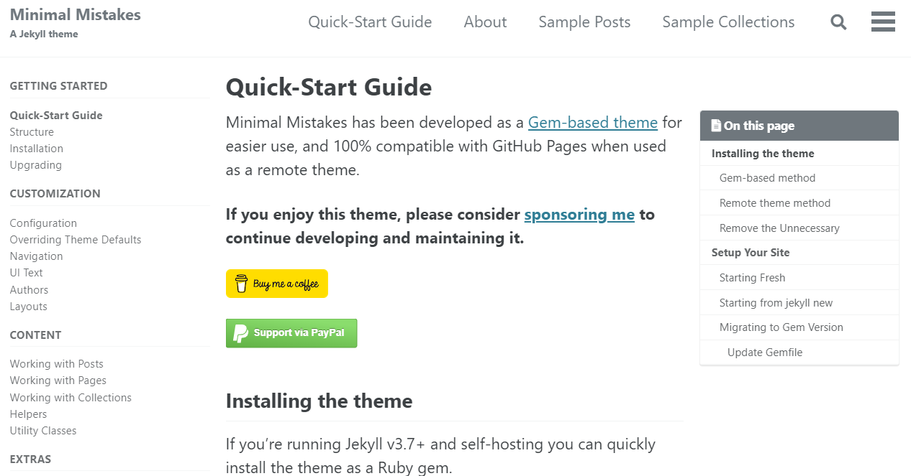

# Welcome 

안녕하세요 Gon 입니다.

## Github 블로그 만들기 동영상

- [깃헙(Github) 블로그 만들기 - 시즌1](https://www.youtube.com/watch?v=--MMmHbSH9k&list=PLIMb_GuNnFwfQBZQwD-vCZENL5YLDZekr)

[깃헙(GitHub) 블로그 10분안에 완성하기](https://www.youtube.com/watch?v=ACzFIAOsfpM)

[새로 포스트 작성하는법](https://jekyllrb.com/docs/posts/)

[Minimal Mistakes](https://mmistakes.github.io/minimal-mistakes/docs/quick-start-guide/)

[[Extensions] VScode에서 이미지 캡쳐를 슬기롭게 사용하는 방법(feat. Paste Image)](https://uxgjs.tistory.com/187)

