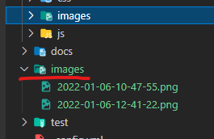

# Welcome 웹기술조립가 Gon

안녕하세요 web technology assembler Gon 입니다.
웹기술은 너무도 빠르게 변화, 발전되고 있습니다. 하나의 기술에 집중하고 있는 과정에서 또다른 기술들이 생겨나고 사라지고, 발전하고 진화하고 있습니다.

하나의 프로젝트는 5개월을 넘어서면 이미 뒤쳐집니다. 그러기위해서 ...
- 최대한 빠르고 개발하여야 하고 
- 최적화된 코드 여야 하며
- 유지보수가 가능 코드

이러한 제품을 만들기 위한 최선의 방법... **웹기술조립 ** 

이 블로그에서는 웹기술조립을 위한 필수 기술, 정보등을 정리하여 소개한다.

## Github 블로그 만들기 동영상

- [깃헙(Github) 블로그 만들기 - 시즌1](https://www.youtube.com/watch?v=--MMmHbSH9k&list=PLIMb_GuNnFwfQBZQwD-vCZENL5YLDZekr)



- [새로 포스트 작성하는법](https://jekyllrb.com/docs/posts/)

- [Minimal Mistakes](https://mmistakes.github.io/minimal-mistakes/docs/quick-start-guide/)

#### 이미지 저장 폴더 설정  

- [VScode에서 이미지 캡쳐를 확장 프로그램 사용하기](https://uxgjs.tistory.com/187)

##### root/images 폴더 생성 한다.
   

##### 저장할 폴더 설졍 변경
  

#### 댓글 기능 
- https://krdn.disqus.com/admin/

#### 구글 애널리틱스
- https://analytics.google.com/
- https://analytics.google.com/analytics/web/provision/#/analysis/p298509910