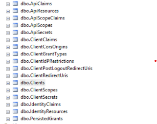
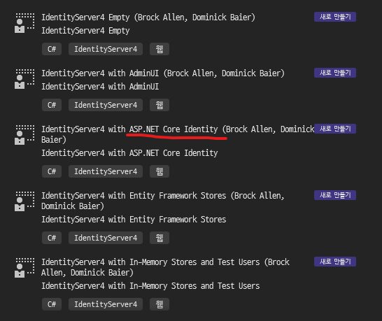

## 선행 학습 

[Oauth 2.0과 OpenID Connect 프로토콜 정리](https://velog.io/@jakeseo_me/Oauth-2.0%EA%B3%BC-OpenID-Connect-%ED%94%84%EB%A1%9C%ED%86%A0%EC%BD%9C-%EC%A0%95%EB%A6%AC)


## [IdentityServer4 공식 문서](https://identityserver4.readthedocs.io/en/latest/index.html)


[.NET Microservices Sample Reference Application](https://github.com/dotnet-architecture/eShopOnContainers)

[.NET Architecture Guides](https://dotnet.microsoft.com/en-us/learn/dotnet/architecture-guides)


[.NET 마이크로 서비스: 컨테이너화된 .NET 애플리케이션을 위한 아키텍처](https://docs.microsoft.com/ko-kr/dotnet/architecture/microservices/?WT.mc_id=dotnet-35129-website)


[IdentityServer4 with PostgreSQL as a persistence store](https://medium.com/@aspram.shadyan.dev/identityserver4-with-postgresql-as-a-persistence-store-9941060d047f)


[IdentityServer4 + Asp.Net Core Identity in a single database](https://roaddd.com/identityserver4-aspnet-identity-single-database/)




## IdentityServer4.Templates 설치 필수

참고: [Using ASP.NET Core Identity](https://docs.identityserver.io/en/dev/quickstarts/8_aspnet_identity.html)

```
dotnet new --install "IdentityServer4.Templates"
```

```
E:\BlazorBoilerplate\bbp_docker (main)
λ dotnet new --install "IdentityServer4.Templates"
다음 템플릿 패키지가 설치됩니다.
   IdentityServer4.Templates

성공:IdentityServer4.Templates::4.0.1이(가) 다음 템플릿을 설치했습니다.
템플릿 이름                                                약식 이름     언어    태그
----------------------------------------------------  --------  ----  -------------------
IdentityServer4 Empty                                 is4empty  [C#]  Web/IdentityServer4
IdentityServer4 Quickstart UI (UI assets only)        is4ui     [C#]  Web/IdentityServer4
IdentityServer4 with AdminUI                          is4admin  [C#]  Web/IdentityServer4
IdentityServer4 with ASP.NET Core Identity            is4aspid  [C#]  Web/IdentityServer4
IdentityServer4 with Entity Framework Stores          is4ef     [C#]  Web/IdentityServer4
IdentityServer4 with In-Memory Stores and Test Users  is4inmem  [C#]  Web/IdentityServer4

```


아래와 같은 2가지 방법으로 Project를 추가 할 수 있음.

#### 1. VS 2019에서 추가하는 방법



#### 2. 직접 cmd명령으로 추가하는 방법
```
dotnet new is4aspid
```


### [OpenID Connect 메타데이터 문서를 가져옵니다.](https://docs.microsoft.com/ko-kr/azure/active-directory/develop/v2-protocols-oidc#fetch-the-openid-connect-metadata-document)


http://localhost:[설정된 포트]/.well-known/openid-configuration


