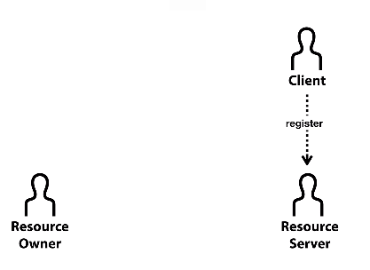

OAuth 2.0의 원리를 이해 함으로써 API를 제어하기 쉽게 하기 위해 생활코딩 강의 참고 하기

## WEB2 - OAuth 2.0 수업 시작 


Client에서 사용하기 위해서는 Resource Server에 미리 등록(Register)해야 함.



### [Resource Server에 Client 등록방법](https://www.youtube.com/watch?v=_mm5ks5aWQ4&list=PLuHgQVnccGMA4guyznDlykFJh28_R08Q-&index=3)
해당동영상에 facebook, google 등록방법이 소개되어 있음.
아래는 google등록후 최종 화면


### [WEB2 - OAuth 2.0 : 4. Resource Owner의 승인](https://www.youtube.com/watch?v=UH5XnjkBqKE&list=PLuHgQVnccGMA4guyznDlykFJh28_R08Q-&index=4)


### [WEB2 - OAuth 2.0 : 5. Resource Server의 승인](https://www.youtube.com/watch?v=O0Rx9SRPzs4&list=PLuHgQVnccGMA4guyznDlykFJh28_R08Q-&index=5)


### [WEB2 - OAuth 2.0 : 6. 액세스 토큰 발급](https://www.youtube.com/watch?v=BofCK1oWAyc&list=PLuHgQVnccGMA4guyznDlykFJh28_R08Q-&index=6)


### [WEB2 - OAuth 2.0 : 7. API 호출](https://www.youtube.com/watch?v=Avdyl5FWdwA&list=PLuHgQVnccGMA4guyznDlykFJh28_R08Q-&index=7)

 아래 두가지 방법으로 호출 가능함. 구글의 경우


웹 서버 애플리케이션에 OAuth 2.0 사용 

[Calling Google APIs](https://developers.google.com/identity/protocols/oauth2/web-server#callinganapi)


### [WEB2 - OAuth 2.0 : 8. refresh token](https://www.youtube.com/watch?v=9eKIYjcPXp4&list=PLuHgQVnccGMA4guyznDlykFJh28_R08Q-&index=8)


[The OAuth 2.0 Authorization Framework](https://datatracker.ietf.org/doc/html/rfc6749)

[1.5 Refresh Token](https://datatracker.ietf.org/doc/html/rfc6749#section-1.5)


```
  +--------+                                           +---------------+
  |        |--(A)------- Authorization Grant --------->|               |
  |        |                                           |               |
  |        |<-(B)----------- Access Token -------------|               |
  |        |               & Refresh Token             |               |
  |        |                                           |               |
  |        |                            +----------+   |               |
  |        |--(C)---- Access Token ---->|          |   |               |
  |        |                            |          |   |               |
  |        |<-(D)- Protected Resource --| Resource |   | Authorization |
  | Client |                            |  Server  |   |     Server    |
  |        |--(E)---- Access Token ---->|          |   |               |
  |        |                            |          |   |               |
  |        |<-(F)- Invalid Token Error -|          |   |               |
  |        |                            +----------+   |               |
  |        |                                           |               |
  |        |--(G)----------- Refresh Token ----------->|               |
  |        |                                           |               |
  |        |<-(H)----------- Access Token -------------|               |
  +--------+           & Optional Refresh Token        +---------------+

               Figure 2: Refreshing an Expired Access Token

                  그림 2에 표시된 흐름에는 다음 단계가 포함됩니다.

   (A) 클라이언트는 다음으로 인증하여 액세스 토큰을 요청합니다.
        권한 부여 서버 및 권한 부여를 제공합니다.

   (B) 권한 부여 서버는 클라이언트를 인증하고 유효성을 검사합니다.
        권한 부여 및 유효한 경우 액세스 토큰을 발급합니다.
        및 새로 고침 토큰.

   (C) 클라이언트가 자원에 보호 자원 요청을 합니다.
        액세스 토큰을 제시하여 서버.

   (D) 리소스 서버는 액세스 토큰의 유효성을 검사하고 유효한 경우
        요청을 제공합니다.

   (E) 액세스 토큰이 만료될 때까지 (C) 및 (D) 단계를 반복합니다. 만약
        클라이언트는 액세스 토큰이 만료되었음을 알고 단계 (G)로 건너뜁니다.
        그렇지 않으면 다른 보호된 리소스를 요청합니다.

   (F) 액세스 토큰이 유효하지 않기 때문에 리소스 서버가
        잘못된 토큰 오류입니다.
```

#### Google identity  참고 자료
[Refreshing an access token (offline access)](https://developers.google.com/identity/protocols/oauth2/web-server#httprest_7)


